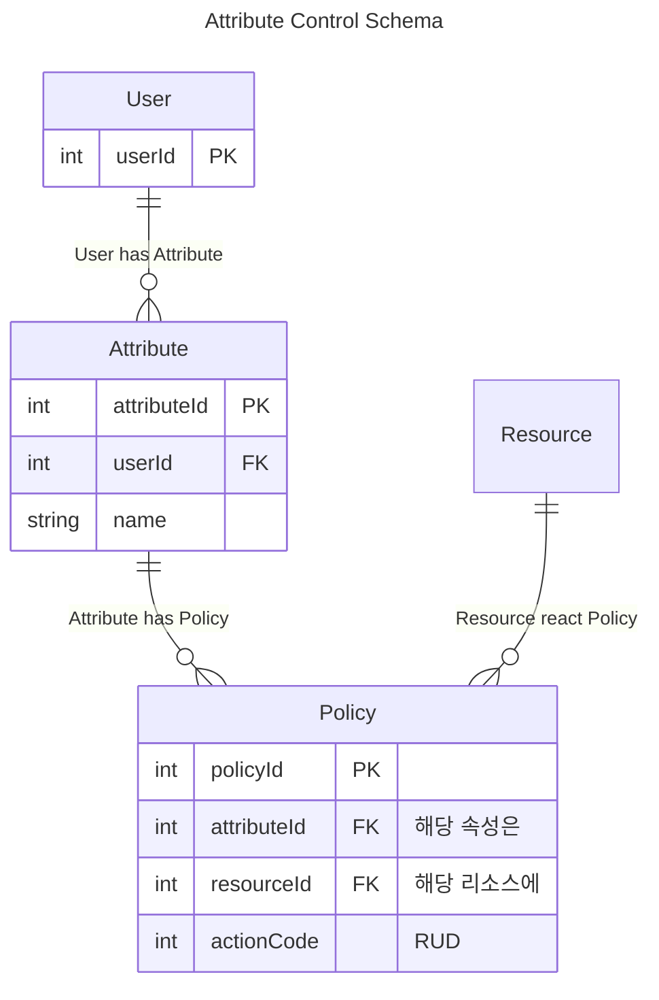
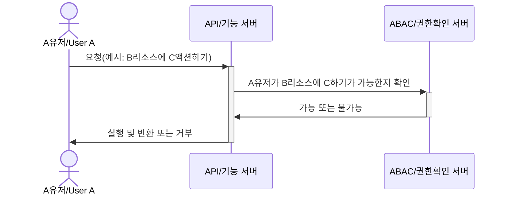

# 접근제어 / Access Control

```mermaid
---
title: Attribute Control Schema
---
erDiagram
  User {
    int userId PK
  }
  Attribute {
    int attributeId PK
    int userId FK
    string name
  }
  Policy {
    int policyId PK
    int attributeId FK "해당 속성은"
    int resourceId FK "해당 리소스에"
    int actionCode "RUD"
  }
  User ||--o{ Attribute: "User has Attribute"
  Attribute ||--o{ Policy: "Attribute has Policy"
  Resource ||--o{ Policy: "Resource react Policy"
```

```mermaid
sequenceDiagram
  actor user as A유저/User A
  participant api as API/기능 서버
  participant abac as ABAC/권한확인 서버

  user->>+api: 요청(예시: B리소스에 C액션하기)
  api->>+abac: A유저가 B리소스에 C하기가 가능한지 확인
  abac->>-api: 가능 또는 불가능


  api->>-user: 실행 및 반환 또는 거부
```
